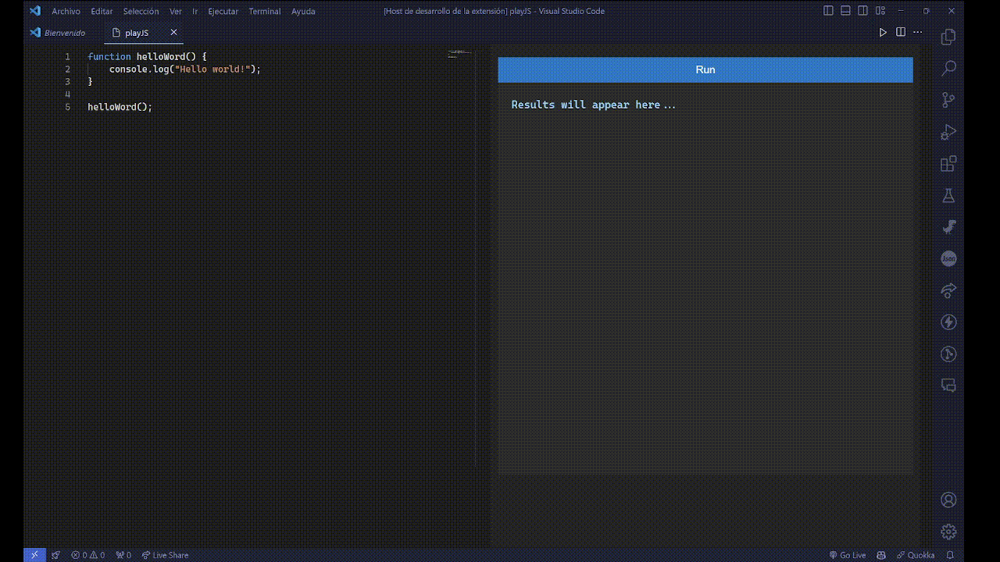

# playjs README

Welcome to the "playjs" extension for Visual Studio Code! This extension offers a powerful JavaScript playground integrated directly within your VS Code environment, allowing you to write, test, and debug JavaScript code snippets quickly and efficiently.

## Features

The playjs extension enhances your coding experience by offering the following features:

- **Integrated JavaScript Execution**: Run JavaScript code snippets directly within a dedicated panel in VS Code.
- **Live Result Display**: See the results of your code execution in real time next to your code.
- **Syntax Highlighting**: Uses the Monaco Editor for rich text editing, complete with syntax highlighting.
- **Code Ligatures**: Supports font ligatures for a more readable code interface, using the popular 'Cascadia Code PL' font.

### Visual Example

Here is how playjs looks in action:

> Tip: Use short, focused animations like the one above to demonstrate your extension's capabilities effectively.

## How to Use

To use playjs, you can execute the command `playjs.runPlayJS`:

1. Open the Command Palette with `Ctrl+Shift+P` (Windows/Linux) or `Cmd+Shift+P` (macOS).
2. Type `Run playJS` and hit enter.

This will open the playJS panel where you can start typing JavaScript code and see the results immediately.

## Requirements

No external dependencies are required for this extension. Just install and start using it!

## Extension Settings

playjs introduces several settings to customize your coding environment:

- `playjs.enable`: Enable/disable the playjs functionality.
- `playjs.showResultsInline`: Toggle whether to display execution results inline with the code.

## Known Issues

- Font ligatures may not display correctly on all systems without 'Cascadia Code PL' installed.

## Release Notes

### 1.0.0

- Initial release of playjs.
  - JavaScript execution within VS Code.
  - Integrated result display.
  - Syntax highlighting with Monaco Editor.

### 1.0.1

- Minor bug fixes and performance improvements.

### 1.1.0

- Added support for code ligatures using 'Cascadia Code PL'.
- Improved UI for result display.

---

## Following Extension Guidelines

Ensure that you've read through the [extensions guidelines](https://code.visualstudio.com/api/references/extension-guidelines) and follow the best practices for creating your extension.

## Working with Markdown

You can author your README using Visual Studio Code. Here are some useful editor keyboard shortcuts:

- Split the editor (`Cmd+\` on macOS or `Ctrl+\` on Windows and Linux).
- Toggle preview (`Shift+Cmd+V` on macOS or `Shift+Ctrl+V` on Windows and Linux).
- Press `Ctrl+Space` (Windows, Linux, macOS) to see a list of Markdown snippets.

## For More Information

- [Visual Studio Code's Markdown Support](http://code.visualstudio.com/docs/languages/markdown)
- [Markdown Syntax Reference](https://help.github.com/articles/markdown-basics/)

**Enjoy coding with playjs!**